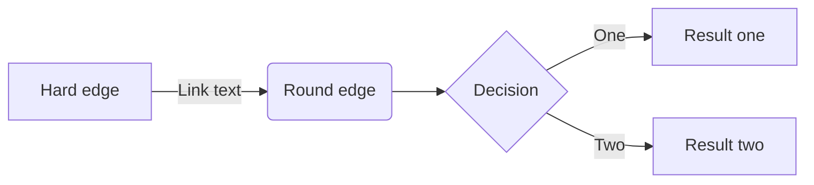
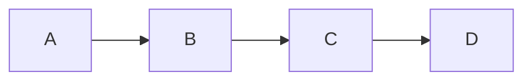

graph RL
    A[Hard edge] -->|Link text| B(Round edge)
    B --> C{Decision}
    C -->|One| D[Result one]
    C -->|Two| E[Result two]

    

    
sequenceDiagram
    participant Alice
    participant Bob
    Alice->>Bob: Hello Bob, how are you?
    Bob-->>Alice: I'm good, thanks! 

graph TB;
    A-->B;
    A-->C;
    B-->D;
    C-->D;

